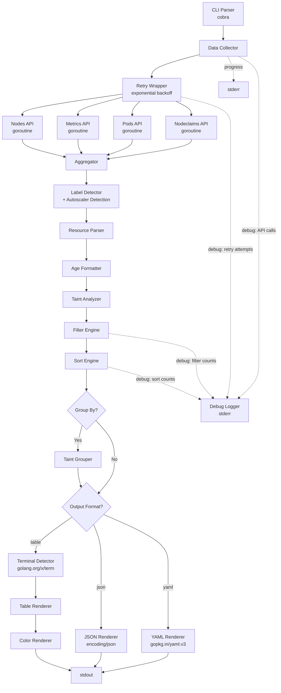

# Design Document: kubectl-k8i Plugin

## Overview

`kubectl-k8i` is a Go-based kubectl plugin that replaces the existing `k8i.sh` bash script. It provides a rich tabular view of Kubernetes node resources — pods, CPU, memory, load percentages with color coding, and node metadata (EC2 instance ID, instance type, capacity type, architecture, zone, nodepool, nodeclaim, age, taints). The plugin collects data from the Kubernetes API using `client-go`, processes everything in memory with concurrent goroutines, and renders a formatted table to stdout.

### Key Design Decisions

1. **Go with client-go**: Eliminates dependencies on `jq`, `bc`, `awk`, `sed`, `grep` and provides cross-platform native binaries. The `client-go` library gives typed access to the Kubernetes API with proper error handling.

2. **cobra for CLI**: Industry-standard CLI framework for kubectl plugins. Provides flag parsing, help generation, and follows kubectl plugin conventions.

3. **tablewriter for output**: The `olekukonern/tablewriter` library handles column alignment, separators, and ANSI color codes in table cells. This avoids manual printf formatting.

4. **In-memory pipeline**: All data flows through Go structs — no temp files, no shelling out. The pipeline is: collect → enrich → filter → sort → (optionally group) → format output.

5. **Concurrent data collection**: Four goroutines fetch nodes, metrics, pods, and nodeclaims in parallel using `errgroup`. This minimizes wall-clock time for large clusters.

6. **rapid for PBT**: The `pgregory.net/rapid` library is a mature Go property-based testing framework with good shrinking support.

7. **Zero external dependencies at runtime**: The plugin is a standalone binary. All output formatting (table, JSON, YAML) is handled in-process using Go standard library (`encoding/json`) and Go modules (`gopkg.in/yaml.v3`). No external tools (jq, bc, awk, sed, grep, date) are required.

8. **Multiple output formats**: The `--output` / `-o` flag supports `table` (default), `json`, and `yaml`. JSON and YAML outputs enable piping to other tools without needing jq, replacing the most common reason users shell out from kubectl plugins.

9. **Terminal-adaptive table rendering**: The table renderer detects terminal width at runtime using `golang.org/x/term` and truncates text columns to fit. This works cross-platform (POSIX ioctl on Linux/macOS, Windows Console API on Windows).

10. **Retry with exponential backoff**: API calls are wrapped in a retry mechanism with exponential backoff and jitter. This handles transient failures (network timeouts, 429 throttling, 5xx errors) gracefully without retrying permanent errors (401, 403, 404). Uses client-go built-in retry where available, custom wrapper otherwise.

11. **Autoscaler type detection**: Each node is classified by its autoscaler (Karpenter, CAS, Spot.io, or unknown) based on label presence with a defined priority chain. This helps users understand their cluster's autoscaling topology.

12. **Structured debug logging**: Enhanced debug mode outputs structured logs (timestamp + level + message) to stderr, covering API calls, retry attempts, data processing steps, and filter/sort operations. This enables effective troubleshooting without polluting stdout.

### Design Rationale

The bash script suffers from several limitations that drive the Go rewrite:
- Platform dependency (requires `jq`, `bc`, `awk`, `sed`, `grep`, `date` with GNU extensions)
- Temp file usage (`/tmp/k8s_nodes_cache.json`, `/tmp/k8s_pods_cache.json`)
- Sequential API calls (one `jq` extraction per node)
- No taint support, no grouping
- Fragile error handling (empty variable checks scattered throughout)
- No structured output — users must pipe through `jq` to extract specific fields

The Go plugin addresses all of these while maintaining the same user-facing table format. The zero-external-dependency design is a core principle: the compiled binary must work on any machine with kubectl access, without requiring jq, bc, awk, sed, grep, or any other tool. Built-in JSON and YAML output formats eliminate the most common reason users reach for jq.

## Architecture



### Package Layout

```
kubectl-k8i/
├── cmd/
│   └── kubectl-k8i/
│       └── main.go              # Entry point
├── pkg/
│   ├── cli/
│   │   └── cli.go               # CLI_Parser: cobra command setup, flag definitions
│   ├── collector/
│   │   └── collector.go         # Data_Collector: parallel API calls, aggregation
│   ├── model/
│   │   └── model.go             # Data models: NodeInfo, ClusterData, etc.
│   ├── parser/
│   │   └── parser.go            # Resource_Parser: CPU/memory string parsing
│   ├── labels/
│   │   └── labels.go            # Label_Detector: label priority chains, normalization
│   ├── age/
│   │   └── age.go               # Age_Formatter: timestamp to human-readable age
│   ├── taints/
│   │   └── taints.go            # Taint_Analyzer: extraction, formatting, grouping
│   ├── filter/
│   │   └── filter.go            # Filter_Engine: attribute-based node filtering
│   ├── sort/
│   │   └── sort.go              # Sort_Engine: multi-column sorting
│   ├── color/
│   │   └── color.go             # Color_Renderer: ANSI color codes, threshold logic
│   ├── output/
│   │   ├── formatter.go         # Output_Formatter: interface + factory for table/json/yaml
│   │   ├── json.go              # JSON renderer using encoding/json
│   │   └── yaml.go              # YAML renderer using gopkg.in/yaml.v3
│   ├── render/
│   │   └── render.go            # Table rendering: header, separator, data rows, terminal-adaptive
│   ├── terminal/
│   │   └── terminal.go          # Terminal_Detector: terminal width detection via golang.org/x/term
│   ├── progress/
│       └── progress.go          # Progress_Reporter: stderr progress indicator
│   ├── retry/
│   │   └── retry.go             # Retry_Wrapper: exponential backoff with jitter for API calls
│   └── debug/
│       └── debug.go             # Debug_Logger: structured debug logging to stderr
├── test/
│   ├── integration/
│   │   └── integration_test.go  # Integration tests with fake clientset
│   ├── e2e/
│   │   └── e2e_test.go          # End-to-end output format tests
│   └── benchmark/
│       └── benchmark_test.go    # Performance benchmarks
├── go.mod
├── go.sum
├── LICENSE
├── README.md
└── krew-manifest.yaml           # Krew plugin manifest
```

### Data Flow

1. **CLI_Parser** parses flags and creates a `RunConfig` struct
2. **Debug_Logger** is initialized based on `--debug` flag, outputs to stderr
3. **Data_Collector** launches 4 goroutines via `errgroup`, each wrapped with **Retry_Wrapper**:
   - Fetch nodes (with optional label selector) — retries on transient errors
   - Fetch node metrics — retries on transient errors
   - Fetch running pods (with `status.phase=Running` field selector) — retries on transient errors
   - Fetch nodeclaims (non-fatal if CRD missing) — retries on transient errors, 404 is non-fatal
4. **Aggregator** joins data by node name using Go maps for O(1) lookups:
   - Pod counts and resource totals per node
   - Metrics per node
   - Nodeclaim names per node
5. **Label_Detector** extracts metadata from node labels using priority chains, including autoscaler type detection (karpenter > spotio > cas > x)
6. **Resource_Parser** converts CPU/memory strings to numeric values
7. **Age_Formatter** converts creation timestamps to human-readable age
8. **Taint_Analyzer** extracts and formats node taints
9. **Filter_Engine** applies `--filter` to the enriched node list (supports autoscaler attribute)
10. **Sort_Engine** applies `--sort` (default: `pool=asc`, supports autoscaler column)
11. **Taint Grouper** (if `--group-by taint`) groups nodes by identical taint sets
12. **Output_Formatter** dispatches to the appropriate renderer based on `--output` flag:
    - `table` (default): **Terminal_Detector** reads terminal width → **Table Renderer** + **Color_Renderer** produce the formatted table
    - `json`: **JSON Renderer** serializes node data via `encoding/json` (includes autoscaler field)
    - `yaml`: **YAML Renderer** serializes node data via `gopkg.in/yaml.v3` (includes autoscaler field)

## Components and Interfaces

### CLI_Parser (`pkg/cli`)

```go
// RunConfig holds all parsed CLI options
type RunConfig struct {
    Context      string // --context
    Labels       string // --labels
    Filter       string // --filter (attribute=value)
    Sort         string // --sort (column=direction)
    Fargate      bool   // --fargate
    Color        *bool  // --color (nil = auto-detect)
    Debug        bool   // --debug
    GroupBy      string // --group-by (currently only "taint")
    Output       string // --output / -o (table, json, yaml; default: table)
    NoHeaders    bool   // --no-headers (suppress header, separator, timestamp, annotations)
}

// NewRootCommand creates the cobra command with all flags
func NewRootCommand() *cobra.Command

// ParseFilter validates and parses "attribute=value" format
// Returns (attribute, value, error)
func ParseFilter(filter string) (string, string, error)

// ParseSort validates and parses "column=direction" format
// Returns (column, direction, error)
func ParseSort(sort string) (string, string, error)

// ValidateOutputFormat validates the output format string
// Returns error if format is not one of: table, json, yaml
func ValidateOutputFormat(format string) error
```

### Resource_Parser (`pkg/parser`)

```go
// ParseCPU converts a Kubernetes CPU string to cores (float64)
// Examples: "500m" → 0.5, "2" → 2.0, "" → 0.0
func ParseCPU(value string) float64

// ParseMemory converts a Kubernetes memory string to gigabytes (float64)
// Examples: "1Gi" → 1.0, "512Mi" → 0.5, "1048576Ki" → 1.0, "" → 0.0
func ParseMemory(value string) float64

// FormatCPU converts cores (float64) to a Kubernetes CPU string
// Used for round-trip testing
func FormatCPU(cores float64) string

// FormatMemory converts gigabytes (float64) to a Kubernetes memory string
// Used for round-trip testing
func FormatMemory(gb float64) string

// ParseCPUMillicores converts a Kubernetes CPU string to millicores (int64)
func ParseCPUMillicores(value string) int64
```

### Label_Detector (`pkg/labels`)

```go
// NodeMetadata holds extracted label values
type NodeMetadata struct {
    EC2InstanceID string
    InstanceType  string
    CapacityType  string // normalized: "spot", "od", "x"
    Architecture  string
    Zone          string // last 2 chars only
    Nodepool      string // truncated to 15 chars for EKS nodegroups
    Nodeclaim     string // truncated to 20 chars
    Autoscaler    string // "karpenter", "cas", "spotio", "x"
}

// ExtractMetadata extracts all metadata from a node's labels and providerID
func ExtractMetadata(labels map[string]string, providerID string) NodeMetadata

// ExtractCapacityType checks the priority chain and normalizes the value
func ExtractCapacityType(labels map[string]string) string

// ExtractNodepool checks the priority chain with EKS truncation
func ExtractNodepool(labels map[string]string) string

// ExtractEC2ID extracts instance ID from providerID using regex
func ExtractEC2ID(providerID string) string

// DetectAutoscaler determines the autoscaler type from node labels
// Priority: karpenter > spotio > cas > x
// Karpenter: karpenter.sh/nodepool OR karpenter.k8s.aws/nodepool
// Spot.io: spotinst.io/ocean-vng-id OR spotinst.io/node-lifecycle (without Karpenter labels)
// CAS: eks.amazonaws.com/nodegroup (without Karpenter or Spot.io labels)
// Unknown: none of the above → "x"
func DetectAutoscaler(labels map[string]string) string
```

### Age_Formatter (`pkg/age`)

```go
// FormatAge converts a creation timestamp to human-readable age
// relative to the given reference time
func FormatAge(creationTime time.Time, now time.Time) string

// FormatAgeFromString parses an ISO timestamp string and formats the age
func FormatAgeFromString(timestamp string) string
```

### Taint_Analyzer (`pkg/taints`)

```go
// FormatTaints converts a slice of Kubernetes taints to display string
// Format: "key=value:effect,key2:effect2" or "none"
func FormatTaints(taints []corev1.Taint) string

// TaintSetKey returns a canonical string key for a set of taints
// Used for grouping nodes by identical taint sets
func TaintSetKey(taints []corev1.Taint) string

// MatchTaintFilter checks if a node's taints match a filter
// Supports "taint=KEY" and "taint=KEY=VALUE" formats
func MatchTaintFilter(taints []corev1.Taint, filterValue string) bool

// SortKeyFromTaints returns a string for lexicographic sorting
// Concatenates taint keys in alphabetical order
func SortKeyFromTaints(taints []corev1.Taint) string

// GroupByTaints groups nodes by their common taint sets
// Returns groups in a stable order
func GroupByTaints(nodes []NodeInfo) [][]NodeInfo
```

### Filter_Engine (`pkg/filter`)

```go
// SupportedFilterAttributes lists valid filter attributes
var SupportedFilterAttributes = []string{
    "ec2_type", "instance_type", "arch", "zone", "pool", "nodeclaim", "taint", "autoscaler",
}

// FilterNodes applies a filter to a slice of NodeInfo
// Returns filtered slice and any error
func FilterNodes(nodes []NodeInfo, attribute, value string) ([]NodeInfo, error)
```

### Sort_Engine (`pkg/sort`)

```go
// SupportedSortColumns lists valid sort columns
var SupportedSortColumns = []string{
    "name", "pods", "cpu_req", "cpu_lim", "cpu_use", "cpu_cap", "cpu_load",
    "mem_req", "mem_lim", "mem_use", "mem_cap", "mem_load",
    "ec2_type", "instance_type", "arch", "zone", "pool", "age", "taint", "autoscaler",
}

// NumericColumns lists columns that use numeric comparison
var NumericColumns = []string{
    "pods", "cpu_req", "cpu_lim", "cpu_use", "cpu_cap", "cpu_load",
    "mem_req", "mem_lim", "mem_use", "mem_cap", "mem_load", "age",
}

// SortNodes sorts a slice of NodeInfo by the specified column and direction
func SortNodes(nodes []NodeInfo, column, direction string) error
```

### Color_Renderer (`pkg/color`)

```go
// ColorConfig holds color rendering settings
type ColorConfig struct {
    Enabled bool
}

// NewColorConfig creates a ColorConfig, auto-detecting terminal support
// if forceColor is nil
func NewColorConfig(forceColor *bool) ColorConfig

// ColorizeLoad applies ANSI color to a load percentage string
// Green ≤60, Yellow 61-80, Red >80
func (c ColorConfig) ColorizeLoad(loadPercent int) string

// DetectColorSupport checks if the terminal supports ANSI colors
func DetectColorSupport() bool
```

### Data_Collector (`pkg/collector`)

```go
// ClusterData holds all raw data collected from the API
type ClusterData struct {
    Nodes      []corev1.Node
    Metrics    []metricsv1beta1.NodeMetrics
    Pods       []corev1.Pod
    Nodeclaims []unstructured.Unstructured // dynamic client for CRD
}

// Collector fetches data from the Kubernetes API
type Collector struct {
    clientset        kubernetes.Interface
    metricsClient    metricsv1beta1client.MetricsV1beta1Interface
    dynamicClient    dynamic.Interface
    labelSelector    string
    progressReporter func(step, total int, message string)
    retryConfig      RetryConfig
    debugLogger      *DebugLogger
}

// Collect fetches all data concurrently using errgroup
// Each API call is wrapped with Retry_Wrapper for transient error handling
// Nodeclaim failures are non-fatal
func (c *Collector) Collect(ctx context.Context) (*ClusterData, error)
```

### Table Renderer (`pkg/render`)

```go
// RenderTable renders the final table to the given writer
// When config.NoHeaders is true, the output contains only data rows —
// no header row, no separator line, no timestamp, no filter/sort annotations.
// This follows the same pattern as `kubectl get pods --no-headers`.
func RenderTable(w io.Writer, nodes []NodeInfo, config RenderConfig)

// RenderConfig holds rendering options
type RenderConfig struct {
    Color        ColorConfig
    Filter       string // display active filter
    Sort         string // display active sort
    GroupByTaint bool
    Timestamp    time.Time
    TermWidth    int    // detected terminal width (0 = no limit)
    NoHeaders    bool   // suppress header, separator, timestamp, annotations
}

// TruncateToFit truncates a string to maxLen, appending "…" if truncated
func TruncateToFit(s string, maxLen int) string

// CalculateColumnWidths computes column widths given the available terminal width
// Numeric columns keep fixed widths; text columns (name, pool, nodeclaim, taints) shrink
func CalculateColumnWidths(termWidth int) ColumnWidths
```

### Terminal_Detector (`pkg/terminal`)

```go
// GetTerminalWidth returns the current terminal width in columns.
// Uses golang.org/x/term which abstracts POSIX ioctl and Windows Console API.
// Returns defaultWidth if detection fails (e.g., stdout is piped to a file).
func GetTerminalWidth(defaultWidth int) int

// IsTerminal returns true if the given file descriptor is a terminal
func IsTerminal(fd uintptr) bool
```

### Retry_Wrapper (`pkg/retry`)

```go
// RetryConfig holds retry configuration
type RetryConfig struct {
    MaxRetries     int           // Maximum number of retry attempts (default: 5)
    InitialBackoff time.Duration // Initial backoff duration (default: 100ms)
    MaxBackoff     time.Duration // Maximum backoff duration (default: 1600ms)
    JitterFraction float64       // Jitter as fraction of backoff (default: 0.5)
    DebugLogger    *DebugLogger  // Optional debug logger for retry attempts
}

// DefaultRetryConfig returns the default retry configuration
// MaxRetries=5, InitialBackoff=100ms, JitterFraction=0.5
func DefaultRetryConfig() RetryConfig

// IsTransientError returns true if the error is transient and should be retried
// Transient: network timeouts, connection refused, 429 Too Many Requests, 5xx server errors
// Permanent (not retried): 401 Unauthorized, 403 Forbidden, 404 Not Found
func IsTransientError(err error) bool

// WithRetry wraps a function with retry logic using exponential backoff with jitter
// Retries only on transient errors; returns immediately on permanent errors
// Backoff sequence: 100ms, 200ms, 400ms, 800ms, 1600ms (with jitter)
func WithRetry(ctx context.Context, config RetryConfig, operation string, fn func() error) error

// CalculateBackoff returns the backoff duration for the given attempt number
// Uses exponential backoff: initialBackoff * 2^attempt, capped at maxBackoff
// Adds random jitter up to jitterFraction of the calculated backoff
func CalculateBackoff(config RetryConfig, attempt int) time.Duration
```

### Debug_Logger (`pkg/debug`)

```go
// DebugLogger provides structured debug logging to stderr
type DebugLogger struct {
    enabled bool
    writer  io.Writer // defaults to os.Stderr
}

// NewDebugLogger creates a new DebugLogger
// When enabled=false, all log methods are no-ops
func NewDebugLogger(enabled bool) *DebugLogger

// LogAPICall logs an API call with URL, method, resource type, duration, and status code
// Format: "2024-01-15T10:30:00Z DEBUG api_call method=GET resource=nodes duration=150ms status=200"
func (d *DebugLogger) LogAPICall(method, resourceType, url string, duration time.Duration, statusCode int)

// LogRetryAttempt logs a retry attempt with attempt number, backoff duration, and error reason
// Format: "2024-01-15T10:30:00Z DEBUG retry attempt=2/5 backoff=400ms error=429 Too Many Requests"
func (d *DebugLogger) LogRetryAttempt(operation string, attempt, maxRetries int, backoff time.Duration, err error)

// LogDataProcessing logs data processing step with counts
// Format: "2024-01-15T10:30:00Z DEBUG data_processing step=nodes_found count=42"
func (d *DebugLogger) LogDataProcessing(step string, count int)

// LogFilterSort logs filter/sort operations with input/output counts
// Format: "2024-01-15T10:30:00Z DEBUG filter_sort operation=filter attribute=zone value=us-east-1a input=42 output=12"
func (d *DebugLogger) LogFilterSort(operation, detail string, inputCount, outputCount int)

// LogTerminalWidth logs the detected terminal width
// Format: "2024-01-15T10:30:00Z DEBUG terminal width=120 detected=true"
func (d *DebugLogger) LogTerminalWidth(width int, detected bool)

// LogOutputFormat logs the output format being used
// Format: "2024-01-15T10:30:00Z DEBUG output format=table"
func (d *DebugLogger) LogOutputFormat(format string)
```

### Output_Formatter (`pkg/output`)

```go
// OutputFormat represents the output format type
type OutputFormat string

const (
    FormatTable OutputFormat = "table"
    FormatJSON  OutputFormat = "json"
    FormatYAML  OutputFormat = "yaml"
)

// Formatter is the interface for output formatters
type Formatter interface {
    // Format writes the node data to the given writer
    Format(w io.Writer, nodes []NodeInfo) error
}

// NewFormatter creates a Formatter for the given output format
func NewFormatter(format OutputFormat) (Formatter, error)

// JSONFormatter renders node data as a JSON array
type JSONFormatter struct{}

// Format writes nodes as a JSON array using encoding/json
func (f *JSONFormatter) Format(w io.Writer, nodes []NodeInfo) error

// YAMLFormatter renders node data as a YAML document
type YAMLFormatter struct{}

// Format writes nodes as a YAML list using gopkg.in/yaml.v3
func (f *YAMLFormatter) Format(w io.Writer, nodes []NodeInfo) error

// NodeOutput is the JSON/YAML-serializable representation of a node
// Uses json and yaml struct tags for field naming
type NodeOutput struct {
    Name           string  `json:"name" yaml:"name"`
    PodsUsed       int     `json:"pods_used" yaml:"pods_used"`
    PodsMax        int     `json:"pods_max" yaml:"pods_max"`
    CPURequestCores  float64 `json:"cpu_request_cores" yaml:"cpu_request_cores"`
    CPULimitCores    float64 `json:"cpu_limit_cores" yaml:"cpu_limit_cores"`
    CPUUsageCores    float64 `json:"cpu_usage_cores" yaml:"cpu_usage_cores"`
    CPUCapacityCores float64 `json:"cpu_capacity_cores" yaml:"cpu_capacity_cores"`
    CPULoadPercent   int     `json:"cpu_load_percent" yaml:"cpu_load_percent"`
    MemRequestGB     float64 `json:"mem_request_gb" yaml:"mem_request_gb"`
    MemLimitGB       float64 `json:"mem_limit_gb" yaml:"mem_limit_gb"`
    MemUsageGB       float64 `json:"mem_usage_gb" yaml:"mem_usage_gb"`
    MemCapacityGB    float64 `json:"mem_capacity_gb" yaml:"mem_capacity_gb"`
    MemLoadPercent   int     `json:"mem_load_percent" yaml:"mem_load_percent"`
    EC2InstanceID    string  `json:"ec2_instance_id" yaml:"ec2_instance_id"`
    InstanceType     string  `json:"instance_type" yaml:"instance_type"`
    CapacityType     string  `json:"capacity_type" yaml:"capacity_type"`
    Architecture     string  `json:"architecture" yaml:"architecture"`
    Zone             string  `json:"zone" yaml:"zone"`
    Nodepool         string  `json:"nodepool" yaml:"nodepool"`
    Nodeclaim        string  `json:"nodeclaim" yaml:"nodeclaim"`
    Autoscaler       string  `json:"autoscaler" yaml:"autoscaler"`
    Age              string  `json:"age" yaml:"age"`
    Taints           string  `json:"taints" yaml:"taints"`
}

// ToNodeOutput converts a NodeInfo to a NodeOutput for serialization
func ToNodeOutput(n NodeInfo) NodeOutput

// ToNodeOutputList converts a slice of NodeInfo to a slice of NodeOutput
func ToNodeOutputList(nodes []NodeInfo) []NodeOutput
```

## Data Models

### NodeInfo — the central data structure

```go
// NodeInfo holds all processed information for a single node
type NodeInfo struct {
    // Identity
    Name string

    // Pod usage
    PodsUsed int
    PodsMax  int

    // CPU (all in cores as float64, millicores as int64 for load calc)
    CPURequestCores  float64
    CPULimitCores    float64
    CPUUsageCores    float64
    CPUCapacityCores float64
    CPURequestMilli  int64
    CPULimitMilli    int64
    CPUUsageMilli    int64
    CPUCapacityMilli int64
    CPULoadPercent   int // (usage_milli * 100) / capacity_milli

    // Memory (all in GB as float64)
    MemRequestGB  float64
    MemLimitGB    float64
    MemUsageGB    float64
    MemCapacityGB float64
    MemLoadPercent int // (usage_gb * 100) / capacity_gb

    // Metadata from labels
    EC2InstanceID string
    InstanceType  string
    CapacityType  string // "spot", "od", "x"
    Architecture  string // "amd64", "arm64"
    Zone          string // last 2 chars, e.g. "1a"
    Nodepool      string
    Nodeclaim     string

    // Autoscaler type
    Autoscaler    string // "karpenter", "cas", "spotio", "x"

    // Age
    CreationTime time.Time
    Age          string // formatted: "5d12h", "3h45m", "12m"

    // Taints
    Taints     []corev1.Taint
    TaintStr   string // formatted for display
    TaintSortKey string // for sorting
}
```

### RunConfig — CLI configuration

```go
type RunConfig struct {
    Context      string
    Labels       string
    Filter       string
    Sort         string
    Fargate      bool
    Color        *bool
    Debug        bool
    GroupBy      string
    Output       string // "table", "json", "yaml"; default: "table"
    NoHeaders    bool   // --no-headers: suppress header, separator, timestamp, annotations
}
```

### Aggregation Maps

```go
// PodAggregation holds per-node pod resource totals
type PodAggregation struct {
    PodCount       int
    CPURequestMilli int64
    CPULimitMilli   int64
    MemRequestGB    float64
    MemLimitGB      float64
}

// The aggregator builds these maps for O(1) lookup:
// podsByNode    map[string]*PodAggregation  — keyed by node name
// metricsByNode map[string]*metricsv1beta1.NodeMetrics — keyed by node name
// nodeclaimByNode map[string]string — node name → nodeclaim name
```

## Correctness Properties

*A property is a characteristic or behavior that should hold true across all valid executions of a system — essentially, a formal statement about what the system should do. Properties serve as the bridge between human-readable specifications and machine-verifiable correctness guarantees.*

### Property 1: CPU parsing round-trip

*For any* valid CPU string (either an integer with "m" suffix or a whole number), parsing to cores then formatting back to a CPU string then parsing again SHALL produce a numerically equivalent value (within floating-point tolerance).

**Validates: Requirements 1.1, 1.2, 1.3, 1.4**

### Property 2: Memory parsing round-trip

*For any* valid memory string (with "Ki", "Mi", or "Gi" suffix), parsing to gigabytes then formatting back to a memory string then parsing again SHALL produce a numerically equivalent value (within floating-point tolerance).

**Validates: Requirements 2.1, 2.2, 2.3, 2.4, 2.5**

### Property 3: Capacity type label priority chain

*For any* label map containing one or more of the capacity type label keys (`karpenter.sh/capacity-type`, `karpenter.k8s.aws/capacity-type`, `spotinst.io/node-lifecycle`, `eks.amazonaws.com/capacityType`), the extracted capacity type SHALL equal the value of the highest-priority key present in the map.

**Validates: Requirements 3.1**

### Property 4: Nodepool label priority chain

*For any* label map containing one or more of the nodepool label keys (`karpenter.sh/nodepool`, `karpenter.k8s.aws/nodepool`, `spotinst.io/ocean-vng-id`, `eks.amazonaws.com/nodegroup`), the extracted nodepool SHALL equal the value of the highest-priority key present in the map (with EKS nodegroup truncated to 15 characters).

**Validates: Requirements 3.2**

### Property 5: Capacity type normalization

*For any* string that is a case-insensitive variant of "on-demand" (with or without hyphen) or "ON_DEMAND", the Label_Detector SHALL normalize the value to "od".

**Validates: Requirements 3.3**

### Property 6: Label value truncation

*For any* string value, when used as an EKS nodegroup label the output SHALL have length ≤ 15 and be a prefix of the original; when used as a nodeclaim name the output SHALL have length ≤ 20 and be a prefix of the original. Strings shorter than the limit SHALL be returned unchanged.

**Validates: Requirements 3.4, 3.10**

### Property 7: Zone suffix extraction

*For any* availability zone string of length ≥ 2, the extracted zone SHALL equal the last 2 characters of the input string.

**Validates: Requirements 3.6**

### Property 8: EC2 instance ID regex extraction

*For any* providerID string containing a substring matching `i-[A-Za-z0-9-]+`, the extracted EC2 ID SHALL match that substring. For providerID strings not containing such a pattern, the result SHALL be empty.

**Validates: Requirements 3.9**

### Property 9: Age formatting by duration range

*For any* non-negative duration: if ≥ 24 hours, the formatted age SHALL match the pattern `{days}d{hours}h`; if ≥ 1 hour and < 24 hours, it SHALL match `{hours}h{minutes}m`; if < 1 hour, it SHALL match `{minutes}m`. The numeric components SHALL be consistent with the input duration.

**Validates: Requirements 4.1, 4.2, 4.3**

### Property 10: Color threshold correctness

*For any* integer load percentage in [0, 100] with colors enabled: if load ≤ 60, the output SHALL contain the green ANSI code (`\033[0;32m`); if 60 < load ≤ 80, the output SHALL contain the yellow ANSI code (`\033[1;33m`); if load > 80, the output SHALL contain the red ANSI code (`\033[0;31m`).

**Validates: Requirements 5.1, 5.2, 5.3**

### Property 11: No ANSI codes when colors disabled

*For any* load percentage value, when the Color_Renderer has colors disabled, the output SHALL NOT contain any ANSI escape sequences (no `\033[` substring).

**Validates: Requirements 5.4**

### Property 12: Only Ready nodes processed

*For any* list of Kubernetes nodes with mixed Ready/NotReady conditions, the processed output SHALL contain only nodes whose Ready condition status is "True".

**Validates: Requirements 6.6**

### Property 13: Filter returns only matching nodes

*For any* list of NodeInfo and any valid filter (attribute=value, including autoscaler), every node in the filtered result SHALL have the specified attribute equal to the specified value, and every node NOT in the result SHALL have a different value for that attribute.

**Validates: Requirements 8.1, 24.6**

### Property 14: Sort asc is reverse of sort desc

*For any* list of NodeInfo and any valid sort column, sorting by that column in ascending order then reversing SHALL produce the same ordering as sorting by that column in descending order.

**Validates: Requirements 9.1, 9.3**

### Property 15: Numeric sort uses numeric comparison

*For any* list of NodeInfo sorted by a numeric column (pods, cpu_req, cpu_lim, cpu_use, cpu_cap, cpu_load, mem_req, mem_lim, mem_use, mem_cap, mem_load, age) in ascending order, each element SHALL have a value ≤ the next element's value when compared numerically (not lexicographically).

**Validates: Requirements 9.7**

### Property 16: Lexicographic sort uses string comparison

*For any* list of NodeInfo sorted by a text column (name, ec2_type, instance_type, arch, zone, pool, taint, autoscaler) in ascending order, each element SHALL have a value ≤ the next element's value when compared as strings.

**Validates: Requirements 9.8**

### Property 17: Fargate nodes hidden by default

*For any* list of nodes containing names with and without the "fargate-" prefix, when the Fargate flag is false, the output SHALL contain zero nodes whose name starts with "fargate-".

**Validates: Requirements 10.10**

### Property 18: Operation order — filter then sort preserves filter invariant

*For any* list of NodeInfo with a filter and sort applied, the result SHALL be equivalent to first filtering then sorting: every node in the output matches the filter, and the output is sorted by the specified column.

**Validates: Requirements 13.1, 13.2, 13.3**

### Property 19: Load percentage calculation

*For any* pair of non-negative values (usage, capacity) where capacity > 0, the load percentage SHALL equal `(usage * 100) / capacity` rounded to an integer. When capacity is 0 or usage is 0, the load percentage SHALL be 0.

**Validates: Requirements 16.1, 16.2, 16.3, 16.4**

### Property 20: Load percentage padding

*For any* load percentage in [0, 9], the formatted string SHALL have a leading zero (format `%02d`), producing a 2-character string.

**Validates: Requirements 16.5**

### Property 21: Taint display format

*For any* list of Kubernetes taints, the formatted string SHALL contain each taint in `key=value:effect` format (or `key:effect` when value is empty), separated by commas. For an empty taint list, the result SHALL be "none".

**Validates: Requirements 17.1, 17.6, 17.7**

### Property 22: Taint filter matching

*For any* list of taints and a filter string: if the filter is `KEY`, the match SHALL be true if and only if any taint has that key; if the filter is `KEY=VALUE`, the match SHALL be true if and only if any taint has that key and value.

**Validates: Requirements 17.2, 17.3**

### Property 23: Taint sort key ordering

*For any* two nodes, when sorted by taint in ascending order, the node whose alphabetically-sorted taint keys concatenation is lexicographically smaller SHALL appear first.

**Validates: Requirements 17.4**

### Property 24: Taint grouping correctness

*For any* list of nodes, when grouped by taint sets, every pair of nodes within the same group SHALL have identical taint sets, and every pair of nodes in different groups SHALL have different taint sets.

**Validates: Requirements 17.5**

### Property 25: JSON output round-trip

*For any* list of NodeInfo, serializing to JSON via the JSON Renderer then deserializing back via `encoding/json` SHALL produce a list with the same number of elements and equivalent field values (within floating-point tolerance for numeric fields).

**Validates: Requirements 21.2, 21.4**

### Property 26: YAML output round-trip

*For any* list of NodeInfo, serializing to YAML via the YAML Renderer then deserializing back via `gopkg.in/yaml.v3` SHALL produce a list with the same number of elements and equivalent field values (within floating-point tolerance for numeric fields).

**Validates: Requirements 21.3, 21.5**

### Property 27: Output format data equivalence

*For any* list of NodeInfo, the JSON output and YAML output SHALL contain the same number of nodes and the same field values for each node — no nodes SHALL be added or omitted based on output format.

**Validates: Requirements 21.6**

### Property 28: Structured output integrity

*For any* list of NodeInfo, when rendered as JSON or YAML, the output SHALL NOT contain any ANSI escape sequences (`\033[`), and all string field values SHALL be untruncated (equal to the original NodeInfo field values regardless of terminal width).

**Validates: Requirements 21.7, 22.8**

### Property 29: Table output fits terminal width

*For any* list of NodeInfo and any terminal width ≥ a minimum threshold, every line of the rendered table output SHALL have a display width ≤ the specified terminal width.

**Validates: Requirements 22.5**

### Property 30: Truncation appends ellipsis

*For any* string and any maximum length where the string length exceeds the maximum, `TruncateToFit` SHALL return a string of length ≤ maximum that ends with the ellipsis character "…". For strings shorter than or equal to the maximum, the string SHALL be returned unchanged.

**Validates: Requirements 22.6**

### Property 31: Numeric columns never truncated

*For any* list of NodeInfo and any terminal width, the numeric column values (pods, CPU, memory, load percentages) in the rendered table output SHALL be identical to the original values — numeric columns SHALL NOT be subject to truncation.

**Validates: Requirements 22.7**

### Property 32: Transient vs permanent error classification

*For any* error returned by a Kubernetes API call, `IsTransientError` SHALL return true if and only if the error is a network timeout, connection refused, 429 Too Many Requests, or 5xx server error. For 401 Unauthorized, 403 Forbidden, and 404 Not Found errors, `IsTransientError` SHALL return false.

**Validates: Requirements 23.1, 23.2**

### Property 33: Exponential backoff with jitter bounds

*For any* retry attempt number `n` (0 ≤ n < maxRetries) and retry configuration with `initialBackoff` and `jitterFraction`, the calculated backoff duration SHALL be within the range `[base, base * (1 + jitterFraction)]` where `base = min(initialBackoff * 2^n, maxBackoff)`.

**Validates: Requirements 23.3, 23.8**

### Property 34: Autoscaler detection priority chain

*For any* label map containing any combination of autoscaler-related labels (`karpenter.sh/nodepool`, `karpenter.k8s.aws/nodepool`, `spotinst.io/ocean-vng-id`, `spotinst.io/node-lifecycle`, `eks.amazonaws.com/nodegroup`), the detected autoscaler type SHALL follow the priority: if any Karpenter label is present → "karpenter"; else if any Spot.io label is present → "spotio"; else if EKS nodegroup label is present → "cas"; else → "x".

**Validates: Requirements 3.11, 24.1, 24.2, 24.3, 24.4, 24.5**

### Property 35: No-headers mode suppresses all non-data output

*For any* list of NodeInfo (including empty lists) and any combination of filter/sort settings, when `NoHeaders` is true, the rendered table output SHALL contain only data rows — it SHALL NOT contain the header row, separator line, timestamp, or filter/sort annotations. The number of output lines SHALL equal the number of nodes in the list.

**Validates: Requirements 7.8, 7.9, 7.10, 7.11, 7.12**

## Error Handling

### Error Categories and Responses

| Error Condition | Severity | Response | Exit Code |
|---|---|---|---|
| Kubernetes API unreachable | Fatal | Retry with backoff up to 5 attempts, then error message to stderr, exit | 1 |
| Invalid Kubernetes context | Fatal | Error message to stderr, exit (no retry — permanent error) | 1 |
| Metrics API unavailable | Degraded | Retry with backoff up to 5 attempts, then continue with zero usage values, warn to stderr | 0 |
| Nodeclaim CRD missing | Degraded | Continue with "x" nodeclaim values (404 is non-fatal for nodeclaims) | 0 |
| No Ready nodes found | Info | Message to stdout, exit | 0 |
| Invalid filter format | Fatal | Error message to stderr with expected format | 1 |
| Unsupported filter attribute | Fatal | Error message to stderr listing supported attributes (incl. autoscaler) | 1 |
| Invalid sort format | Fatal | Error message to stderr with expected format | 1 |
| Unsupported sort column | Fatal | Error message to stderr listing supported columns (incl. autoscaler) | 1 |
| Unknown CLI flag | Fatal | Error message to stderr, suggest --help | 1 |
| Missing flag value | Fatal | Error message to stderr indicating missing value | 1 |
| Unsupported output format | Fatal | Error message to stderr listing supported formats (table, json, yaml) | 1 |
| YAML serialization error | Fatal | Error message to stderr with serialization details | 1 |
| Terminal width detection failure | Degraded | Default to 200 columns, continue rendering | 0 |
| Transient API error (429, 5xx, timeout) | Transient | Retry with exponential backoff + jitter (100ms→1600ms), max 5 attempts | 1 (if exhausted) |
| Permanent API error (401, 403) | Fatal | No retry, immediate error message to stderr, exit | 1 |
| All retries exhausted | Fatal | Error message to stderr with retry count and last error, exit | 1 |

### Concurrent Error Handling

The Data_Collector uses `golang.org/x/sync/errgroup` with a context:

```go
g, ctx := errgroup.WithContext(parentCtx)

// Each goroutine wraps its API call with Retry_Wrapper:
// retry.WithRetry(ctx, retryConfig, "list-nodes", func() error { ... })
// If nodes, metrics, or pods API call fails after all retries → context is cancelled → remaining goroutines abort
// If nodeclaims API call fails → error is captured but not propagated to errgroup (404 is non-fatal)
```

The nodeclaim goroutine runs outside the errgroup (or catches its own error) so that a missing CRD doesn't cancel the other API calls. The Retry_Wrapper handles transient errors transparently — each goroutine only sees the final success or the last error after retries are exhausted.

### Debug Mode

When `--debug true` is set, the Debug_Logger outputs structured logs to stderr with timestamp + level + message format:

- **API calls**: Each API call logs URL, method, resource type, duration, and response status code
  - Example: `2024-01-15T10:30:00Z DEBUG api_call method=GET resource=nodes duration=150ms status=200`
- **Retry attempts**: Each retry logs attempt number, backoff duration, and error reason
  - Example: `2024-01-15T10:30:00Z DEBUG retry attempt=2/5 backoff=400ms error="429 Too Many Requests"`
- **Data processing**: Logs counts at each processing step (nodes found, pods found, metrics entries, nodeclaims)
  - Example: `2024-01-15T10:30:00Z DEBUG data_processing step=nodes_found count=42`
  - Example: `2024-01-15T10:30:00Z DEBUG data_processing step=pods_found count=350`
  - Example: `2024-01-15T10:30:00Z DEBUG data_processing step=metrics_entries count=42`
- **Filter/sort operations**: Logs input/output counts for filter and sort operations
  - Example: `2024-01-15T10:30:00Z DEBUG filter_sort operation=filter attribute=zone value=us-east-1a input=42 output=12`
  - Example: `2024-01-15T10:30:00Z DEBUG filter_sort operation=sort column=cpu_load direction=desc input=12 output=12`
- **Terminal width**: Logs detected terminal width and whether detection succeeded
  - Example: `2024-01-15T10:30:00Z DEBUG terminal width=120 detected=true`
- **Output format**: Logs the output format being used
  - Example: `2024-01-15T10:30:00Z DEBUG output format=table`
- No sensitive data (tokens, secrets) is ever logged
- All debug output goes to stderr to avoid polluting stdout

### Output Routing

- Normal table/JSON/YAML output → stdout
- Progress indicator → stderr (suppressed for JSON/YAML output)
- Error messages → stderr
- Debug output → stderr

This allows piping stdout to files or other tools while keeping diagnostic output visible. JSON and YAML outputs are clean structured data with no headers, timestamps, or progress indicators mixed in.

## Testing Strategy

### Testing Framework and Libraries

| Purpose | Library | Rationale |
|---|---|---|
| Unit tests | `testing` (stdlib) | Standard Go testing |
| Property-based tests | `pgregory.net/rapid` | Mature Go PBT library with good shrinking |
| Assertions | `github.com/stretchr/testify/assert` | Readable assertions, widely used |
| Fake Kubernetes client | `k8s.io/client-go/kubernetes/fake` | Official fake clientset for integration tests |
| Fake metrics client | `k8s.io/metrics/pkg/client/clientset/versioned/fake` | Official fake metrics client |
| Benchmarks | `testing.B` (stdlib) | Standard Go benchmarks |
| JSON serialization | `encoding/json` (stdlib) | Standard Go JSON — zero external dependency |
| YAML serialization | `gopkg.in/yaml.v3` | De facto standard Go YAML library |
| Terminal width detection | `golang.org/x/term` | Official Go extended library, cross-platform (POSIX + Windows) |
| Time mocking for retry tests | `github.com/benbjohnson/clock` or manual injection | Deterministic backoff testing without real sleeps |

### Test Organization

```
pkg/parser/parser_test.go          # Unit + property tests for Resource_Parser
pkg/labels/labels_test.go          # Unit + property tests for Label_Detector
pkg/age/age_test.go                # Unit + property tests for Age_Formatter
pkg/color/color_test.go            # Unit + property tests for Color_Renderer
pkg/filter/filter_test.go          # Unit + property tests for Filter_Engine
pkg/sort/sort_test.go              # Unit + property tests for Sort_Engine
pkg/taints/taints_test.go          # Unit + property tests for Taint_Analyzer
pkg/cli/cli_test.go                # Unit tests for CLI_Parser (incl. --output/-o flag)
pkg/collector/collector_test.go    # Unit tests for aggregation logic
pkg/render/render_test.go          # Unit + property tests for table rendering + terminal adaptation
pkg/output/formatter_test.go       # Unit + property tests for JSON/YAML output formatters
pkg/terminal/terminal_test.go      # Unit tests for terminal width detection
pkg/retry/retry_test.go            # Unit + property tests for Retry_Wrapper
pkg/debug/debug_test.go            # Unit tests for Debug_Logger
test/integration/integration_test.go  # Integration tests (build tag: integration)
test/e2e/e2e_test.go              # End-to-end output tests (table, JSON, YAML)
test/benchmark/benchmark_test.go   # Performance benchmarks
```

### Property-Based Tests

Each property test uses `rapid.Check` with a minimum of 100 iterations. Each test is tagged with a comment referencing the design property.

```go
// Feature: kubectl-k8i-plugin, Property 1: CPU parsing round-trip
func TestCPURoundTrip(t *testing.T) {
    rapid.Check(t, func(t *rapid.T) {
        // Generate random valid CPU string
        millis := rapid.IntRange(0, 1000000).Draw(t, "millis")
        cpuStr := fmt.Sprintf("%dm", millis)
        // Round-trip: parse → format → parse
        parsed := parser.ParseCPU(cpuStr)
        formatted := parser.FormatCPU(parsed)
        reparsed := parser.ParseCPU(formatted)
        assert.InDelta(t, parsed, reparsed, 0.001)
    })
}
```

**Property test mapping:**

| Property | Test Function | Package |
|---|---|---|
| P1: CPU round-trip | `TestCPURoundTrip` | `pkg/parser` |
| P2: Memory round-trip | `TestMemoryRoundTrip` | `pkg/parser` |
| P3: Capacity type priority | `TestCapacityTypePriority` | `pkg/labels` |
| P4: Nodepool priority | `TestNodepoolPriority` | `pkg/labels` |
| P5: Capacity type normalization | `TestCapacityTypeNormalization` | `pkg/labels` |
| P6: Label value truncation | `TestLabelValueTruncation` | `pkg/labels` |
| P7: Zone suffix extraction | `TestZoneSuffixExtraction` | `pkg/labels` |
| P8: EC2 ID regex extraction | `TestEC2IDExtraction` | `pkg/labels` |
| P9: Age formatting | `TestAgeFormatting` | `pkg/age` |
| P10: Color threshold | `TestColorThreshold` | `pkg/color` |
| P11: No ANSI when disabled | `TestNoANSIWhenDisabled` | `pkg/color` |
| P12: Only Ready nodes | `TestOnlyReadyNodes` | `pkg/collector` |
| P13: Filter matching | `TestFilterMatching` | `pkg/filter` |
| P14: Sort asc/desc symmetry | `TestSortAscDescSymmetry` | `pkg/sort` |
| P15: Numeric sort | `TestNumericSort` | `pkg/sort` |
| P16: Lexicographic sort | `TestLexicographicSort` | `pkg/sort` |
| P17: Fargate hiding | `TestFargateHiding` | `pkg/filter` |
| P18: Filter-then-sort order | `TestFilterThenSortOrder` | `pkg/filter` + `pkg/sort` |
| P19: Load percentage calc | `TestLoadPercentageCalc` | `pkg/parser` |
| P20: Load percentage padding | `TestLoadPercentagePadding` | `pkg/color` |
| P21: Taint display format | `TestTaintDisplayFormat` | `pkg/taints` |
| P22: Taint filter matching | `TestTaintFilterMatching` | `pkg/taints` |
| P23: Taint sort key ordering | `TestTaintSortKeyOrdering` | `pkg/taints` |
| P24: Taint grouping | `TestTaintGrouping` | `pkg/taints` |
| P25: JSON round-trip | `TestJSONRoundTrip` | `pkg/output` |
| P26: YAML round-trip | `TestYAMLRoundTrip` | `pkg/output` |
| P27: Output format data equivalence | `TestOutputFormatEquivalence` | `pkg/output` |
| P28: Structured output integrity | `TestStructuredOutputIntegrity` | `pkg/output` |
| P29: Table fits terminal width | `TestTableFitsTerminalWidth` | `pkg/render` |
| P30: Truncation appends ellipsis | `TestTruncationEllipsis` | `pkg/render` |
| P31: Numeric columns never truncated | `TestNumericColumnsNotTruncated` | `pkg/render` |
| P32: Transient vs permanent error classification | `TestTransientVsPermanentError` | `pkg/retry` |
| P33: Exponential backoff with jitter bounds | `TestExponentialBackoffBounds` | `pkg/retry` |
| P34: Autoscaler detection priority chain | `TestAutoscalerDetectionPriority` | `pkg/labels` |
| P35: No-headers mode suppresses all non-data output | `TestNoHeadersMode` | `pkg/render` |

### Unit Tests

Unit tests cover specific examples, edge cases, and error conditions:

- **Resource_Parser**: "500m"→0.5, "2"→2.0, ""→0.0, "0m"→0.0, "1Gi"→1.0, "512Mi"→0.5, "1048576Ki"→1.0
- **Label_Detector**: All 4 priority chains with single/multiple labels, normalization of "on-demand"/"On-Demand"/"ON_DEMAND"/"ondemand", truncation at boundaries (14, 15, 16 chars for EKS; 19, 20, 21 chars for nodeclaim), missing labels → "x", EC2 ID extraction from various providerID formats, autoscaler detection for each type (karpenter, cas, spotio, x), autoscaler priority when multiple labels present
- **Age_Formatter**: 0m, 59m, 1h0m, 23h59m, 1d0h, 365d0h, zero time → "x"
- **Color_Renderer**: Boundary values 0, 60, 61, 80, 81, 100; colors disabled; non-numeric input
- **Filter_Engine**: Each of 8 attributes (incl. autoscaler) with matching/non-matching values; unsupported attribute error; invalid format error
- **Sort_Engine**: Each of 20 columns (incl. autoscaler) in both directions; numeric vs lexicographic verification (9 < 10 numerically, "9" > "10" lexicographically); default sort; unsupported column error; invalid format error
- **CLI_Parser**: Each flag individually and in combination; missing values; unknown flags; --help output; `--output table`/`json`/`yaml`; `-o` short alias; unsupported output format error; default output format is `table`; `--no-headers` sets `NoHeaders=true`; default `NoHeaders` is `false`
- **Taint_Analyzer**: Single taint, multiple taints, no taints, taint with empty value, filter by key, filter by key=value, sort key generation, grouping
- **Output_Formatter**: JSON output is valid JSON; YAML output is valid YAML; empty node list produces empty array/list; NodeOutput struct tags match expected field names; JSON output contains no ANSI codes; YAML output contains no ANSI codes
- **Terminal_Detector**: Returns positive integer for terminal fd; returns default width (200) for non-terminal fd (piped output); IsTerminal returns correct bool
- **Retry_Wrapper**: Transient error triggers retry (network timeout, connection refused, 429, 500, 502, 503, 504); permanent error does not trigger retry (401, 403, 404); max 5 retries then returns error; backoff doubles each attempt; jitter is within bounds; successful retry returns nil; context cancellation stops retries; error message includes retry count
- **Debug_Logger**: LogAPICall outputs correct format with timestamp, method, resource, duration, status; LogRetryAttempt outputs attempt number, backoff, error; LogDataProcessing outputs step and count; LogFilterSort outputs operation, input/output counts; disabled logger produces no output; all output goes to stderr
- **Table Renderer (terminal-adaptive)**: Full-width rendering when terminal is wide enough; truncated columns when terminal is narrow; ellipsis appended to truncated values; numeric columns never truncated; node name, nodepool, nodeclaim, taints columns truncated proportionally; `--no-headers` mode outputs only data rows with no header, separator, timestamp, or annotations

### Integration Tests (build tag: `integration`)

Integration tests use `client-go` fake clientset to simulate realistic cluster scenarios:

1. **Full pipeline test**: Create fake nodes with Karpenter/Spotinst/EKS labels, fake pods with resource requests/limits, fake metrics, fake nodeclaims → verify complete table output
2. **Label priority test**: Nodes with overlapping label providers → verify correct priority chain
3. **Filter integration**: Apply each filter attribute to a mixed cluster → verify correct filtering
4. **Sort integration**: Sort by each column → verify correct ordering in full output
5. **Taint grouping**: Nodes with various taint sets → verify group separators in output
6. **Fargate hiding**: Mix of regular and fargate nodes → verify hiding/showing
7. **Metrics unavailable**: Fake metrics client returns error → verify zero usage values, no crash
8. **Nodeclaim CRD missing**: Dynamic client returns not-found → verify "x" values, no crash
9. **Empty cluster**: No Ready nodes → verify appropriate message
10. **Output format**: Verify header, separator, timestamp, filter/sort annotations match expected format
11. **Retry integration**: Fake API client returns transient errors for first N calls, then succeeds → verify data collection completes after retries
12. **Autoscaler detection**: Nodes with Karpenter labels, Spot.io labels, EKS labels, and no autoscaler labels → verify correct autoscaler type in output
13. **Autoscaler filter**: Apply `--filter autoscaler=karpenter` to mixed cluster → verify only Karpenter nodes shown
14. **Autoscaler sort**: Apply `--sort autoscaler=asc` → verify nodes sorted by autoscaler type lexicographically
15. **Debug mode output**: Enable `--debug true` → verify stderr contains structured log entries for API calls, data processing counts, and filter/sort operations

### End-to-End Output Tests

E2E tests verify the complete rendered output against golden files:

- Standard output with mixed node types
- Output with `--filter ec2_type=spot`
- Output with `--sort cpu_load=desc`
- Output with `--group-by taint`
- Output with `--fargate`
- Output with `--color false` (no ANSI codes)
- Output with no matching filter results
- Output with `--output json` (valid JSON array, no ANSI codes, no headers)
- Output with `--output yaml` (valid YAML document, no ANSI codes, no headers)
- Output with `-o json` (short alias works identically to `--output json`)
- Table output at narrow terminal width (80 columns) — verify truncation and ellipsis
- Table output at very narrow terminal width (60 columns) — verify graceful degradation
- JSON/YAML output is unaffected by terminal width
- Output with `--filter autoscaler=karpenter` (only Karpenter nodes shown)
- Output with `--sort autoscaler=asc` (nodes sorted by autoscaler type)
- JSON/YAML output includes autoscaler field for each node
- Output with `--debug true` produces structured debug logs on stderr
- Output with `--no-headers` contains only data rows (no header, separator, timestamp, or annotations)
- Output with `--no-headers --filter ec2_type=spot` contains only filtered data rows with no annotations
- Retry behavior: transient API error followed by success produces correct output

### Benchmark Tests

```go
func BenchmarkProcess1000Nodes(b *testing.B) {
    // Generate 1000 fake nodes with 10 pods each (10000 pods total)
    // Measure: collection aggregation + filter + sort + render
}

func BenchmarkResourceAggregation(b *testing.B) {
    // Measure per-node resource aggregation with map lookups
}

func BenchmarkFilterAndSort(b *testing.B) {
    // Measure filter + sort on 1000 nodes
}

func BenchmarkTableRender(b *testing.B) {
    // Measure table rendering for 1000 rows
}
```

### Error Handling Tests

- Metrics API returns error → verify zero usage, operation continues
- Nodeclaim CRD missing → verify "x" values, operation continues
- Empty cluster (zero Ready nodes) → verify message
- Invalid context → verify error message
- `--color false` → verify no ANSI escape codes in output
- Color detection on current platform → verify DetectColorSupport returns bool
- Transient API error (429) → verify retry with backoff, then success
- Transient API error (5xx) → verify retry with backoff, then success
- Permanent API error (401) → verify no retry, immediate error
- Permanent API error (403) → verify no retry, immediate error
- All retries exhausted → verify error message includes retry count
- Network timeout → verify retry with backoff

### Coverage Target

Core logic packages (`parser`, `labels`, `age`, `color`, `filter`, `sort`, `taints`, `output`, `terminal`, `retry`, `debug`) SHALL achieve ≥ 80% test coverage. The `collector` and `render` packages target ≥ 70% coverage (harder to unit test due to API dependencies and terminal interaction).

### Running Tests

```bash
# Unit + property tests
go test ./pkg/...

# Integration tests
go test -tags=integration ./test/integration/...

# E2E tests
go test ./test/e2e/...

# Benchmarks
go test -bench=. ./test/benchmark/...

# Coverage report
go test -coverprofile=coverage.out ./pkg/...
go tool cover -func=coverage.out
```

