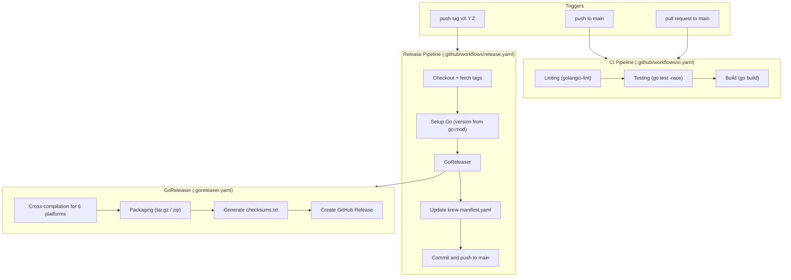

# Design Document: Release Automation

## Overview

This design describes the implementation of the CI/CD infrastructure for the kubectl-k8i project. The solution consists of five configuration files:

1. **`.github/workflows/ci.yaml`** — CI pipeline (linting, testing, building) on push/PR to main
2. **`.github/workflows/release.yaml`** — Release pipeline triggered by a `vX.Y.Z` git tag
3. **`.goreleaser.yaml`** — GoReleaser configuration for cross-compilation, packaging, and publishing
4. **`Makefile`** — Targets for local development
5. **`.golangci.yaml`** — golangci-lint configuration

Additionally, a version variable needs to be added to the code for embedding via ldflags, and a krew manifest update script needs to be added to the release pipeline.

### Key Decisions

- **GoReleaser v2** is used as the industry standard for Go projects: cross-compilation, packaging, checksum generation, and GitHub Release creation — all in one tool.
- **Pinning GitHub Actions by commit SHA** — protection against supply-chain attacks (requirement 13).
- **Go version from `go.mod`** — single source of truth for the Go version across all pipelines.
- **`pkg/version` package** for storing the version variable — clean separation of concerns, convenient for ldflags.
- **Inline script for krew manifest update** — no external dependencies, using `sed` and data from `checksums.txt`.

## Architecture

### Component Interaction Diagram



### File Structure Diagram

```
kubectl-k8i/
├── .github/
│   └── workflows/
│       ├── ci.yaml              # CI pipeline
│       └── release.yaml         # Release pipeline
├── .golangci.yaml               # Linter configuration
├── .goreleaser.yaml             # GoReleaser configuration
├── Makefile                     # Targets for local development
├── pkg/
│   └── version/
│       └── version.go           # Version variable (ldflags)
├── cmd/
│   └── kubectl-k8i/
│       └── main.go              # Entry point (unchanged)
├── krew-manifest.yaml           # Krew manifest (updated automatically)
└── ...
```

## Components and Interfaces

### 1. CI Pipeline (`.github/workflows/ci.yaml`)

**Triggers:** `push` to the `main` branch, `pull_request` targeting the `main` branch.

**Permissions:** `contents: read` (minimal, requirement 13.4).

**Steps:**

| Step | Action | Description |
|------|--------|-------------|
| 1. Checkout | `actions/checkout` (pinned SHA) | Clone the repository |
| 2. Setup Go | `actions/setup-go` (pinned SHA) | Install Go, version from `go.mod` (`go-version-file: go.mod`) |
| 3. Lint | `golangci/golangci-lint-action` (pinned SHA) | Run golangci-lint with configuration from `.golangci.yaml` |
| 4. Test | `run: go test -race ./pkg/...` | Unit tests with race detector |
| 5. Build | `run: go build ./cmd/kubectl-k8i/` | Verify compilation |

**Rationale:** Three steps (lint → test → build) run sequentially in a single job. This is simpler than parallel jobs and fast enough for a Go project of this size. The Go version is taken from `go.mod` via `go-version-file`, which prevents version drift.

### 2. Release Pipeline (`.github/workflows/release.yaml`)

**Trigger:** `push` of tags matching the pattern `v*.*.*`.

**Permissions:** `contents: write` (for creating GitHub Release and pushing commits, requirement 13.3).

**Steps:**

| Step | Action | Description |
|------|--------|-------------|
| 1. Checkout | `actions/checkout` (pinned SHA) | Clone with `fetch-depth: 0` (for changelog) and `fetch-tags: true` |
| 2. Setup Go | `actions/setup-go` (pinned SHA) | Install Go, version from `go.mod` |
| 3. GoReleaser | `goreleaser/goreleaser-action` (pinned SHA) | Run `goreleaser release --clean` |
| 4. Update Krew | `run: bash script` | Parse checksums.txt, update krew-manifest.yaml |
| 5. Commit & Push | `run: git commit && git push` | Commit the updated manifest to main |

**Rationale:** `fetch-depth: 0` is required by GoReleaser for generating the changelog between tags. The GoReleaser Action automatically installs GoReleaser and runs it with the configuration from `.goreleaser.yaml`.

### 3. GoReleaser Configuration (`.goreleaser.yaml`)

```yaml
version: 2

builds:
  - id: kubectl-k8i
    main: ./cmd/kubectl-k8i
    binary: kubectl-k8i
    env:
      - CGO_ENABLED=0
    ldflags:
      - -s -w
      - -X github.com/kubectl-k8i/pkg/version.Version={{.Version}}
    goos:
      - linux
      - darwin
      - windows
    goarch:
      - amd64
      - arm64

archives:
  - id: kubectl-k8i
    builds:
      - kubectl-k8i
    name_template: "kubectl-k8i_{{ .Os }}_{{ .Arch }}"
    format_overrides:
      - goos: windows
        format: zip
    files:
      - LICENSE

checksum:
  name_template: "checksums.txt"
  algorithm: sha256

changelog:
  sort: asc
  filters:
    exclude:
      - "^docs:"
      - "^chore:"
      - "^ci:"
      - "^test:"

release:
  github:
    owner: kubectl-k8i
    name: kubectl-k8i
```

**Key Decisions:**

- **`CGO_ENABLED=0`** — static linking, the binary does not depend on the target platform's libc.
- **`-s -w`** — strip debug information to reduce binary size.
- **`format_overrides`** — tar.gz by default for linux/darwin, zip for windows (requirements 6.1, 6.2).
- **`name_template`** — template `kubectl-k8i_<os>_<arch>` (requirement 6.3).
- **`files: [LICENSE]`** — include the license in each archive (requirement 6.4).
- **`changelog.filters.exclude`** — exclude maintenance commits from the changelog for a cleaner release description.

### 4. Krew Manifest Update

After GoReleaser completes, the release pipeline executes an inline bash script:

1. Extracts the version from `GITHUB_REF_NAME` (e.g., `v1.2.3`).
2. Parses `dist/checksums.txt` to obtain SHA256 hashes for each archive.
3. For each of the 6 platforms, updates the following in `krew-manifest.yaml`:
   - The `sha256` field — actual hash from checksums.txt
   - The `uri` field — URL with the substituted version
4. Updates `spec.version` to the value from the tag.
5. Creates a commit and pushes to main.

**Algorithm for parsing checksums.txt:**

```bash
# checksums.txt format:
# <sha256>  kubectl-k8i_linux_amd64.tar.gz
# <sha256>  kubectl-k8i_linux_arm64.tar.gz
# ...

VERSION="${GITHUB_REF_NAME}"

# For each platform: extract hash from checksums.txt
SHA_LINUX_AMD64=$(grep "kubectl-k8i_linux_amd64.tar.gz" dist/checksums.txt | awk '{print $1}')
# ... similarly for the remaining 5 platforms

# Update krew-manifest.yaml using sed
```

**Rationale:** An inline script instead of a separate file — minimal moving parts. `sed` is available on all GitHub Actions runners. The alternative (yq) would require additional installation.

### 5. Version Package (`pkg/version/version.go`)

```go
package version

// Version is set at build time via ldflags.
// Default value "dev" is used for local development builds.
var Version = "dev"
```

**Rationale:** A separate `pkg/version` package instead of a variable in `main.go`:
- Any package in the project can import the version (e.g., for a `--version` CLI flag).
- The ldflags path is stable: `github.com/kubectl-k8i/pkg/version.Version`.
- The default value `"dev"` is used for local builds without ldflags.

GoReleaser passes the version via ldflags:
```
-X github.com/kubectl-k8i/pkg/version.Version={{.Version}}
```

Makefile passes `dev`:
```
-X github.com/kubectl-k8i/pkg/version.Version=dev
```

### 6. Makefile

```makefile
.DEFAULT_GOAL := build

VERSION ?= dev
LDFLAGS := -X github.com/kubectl-k8i/pkg/version.Version=$(VERSION)

.PHONY: build test lint test-integration test-e2e test-bench release-local clean

build:
	go build -ldflags "$(LDFLAGS)" -o kubectl-k8i ./cmd/kubectl-k8i/

test:
	go test -race ./pkg/...

lint:
	golangci-lint run

test-integration:
	go test -tags=integration ./test/integration/...

test-e2e:
	go test ./test/e2e/...

test-bench:
	go test -bench=. ./test/benchmark/...

release-local:
	goreleaser release --snapshot --clean

clean:
	rm -f kubectl-k8i
	rm -rf dist/
```

**Rationale:**
- `VERSION ?= dev` — variable with a default value, can be overridden: `make build VERSION=v1.0.0`.
- `.PHONY` — all targets do not create files with corresponding names.
- `.DEFAULT_GOAL := build` — `make` without arguments performs the build (requirement 11.9).

### 7. golangci-lint Configuration (`.golangci.yaml`)

```yaml
run:
  timeout: 5m

linters:
  enable:
    - errcheck
    - govet
    - staticcheck
    - unused
    - ineffassign
    - gosimple

issues:
  exclude-use-default: false
```

**Rationale:** A minimal set of reliable linters that do not produce false positives. The set can be expanded later. A 5-minute timeout is sufficient for a project of this size.

### 8. Pinning GitHub Actions by SHA (Security)

All third-party actions are pinned by the commit SHA of a specific release. This protects against:
- Tag rewriting by an attacker
- Injection of malicious code into an action after release

Actions and their versions used:

| Action | Version | Purpose |
|--------|---------|---------|
| `actions/checkout` | v4 (pinned SHA) | Clone the repository |
| `actions/setup-go` | v5 (pinned SHA) | Install Go |
| `golangci/golangci-lint-action` | v6 (pinned SHA) | Run the linter |
| `goreleaser/goreleaser-action` | v6 (pinned SHA) | Run GoReleaser |

Format in the workflow:
```yaml
- uses: actions/checkout@<full-sha>  # v4
```

A comment with the version number after the SHA — for readability and ease of updating.

## Data Models

### checksums.txt Structure

```
<sha256_hex_64_chars>  kubectl-k8i_linux_amd64.tar.gz
<sha256_hex_64_chars>  kubectl-k8i_linux_arm64.tar.gz
<sha256_hex_64_chars>  kubectl-k8i_darwin_amd64.tar.gz
<sha256_hex_64_chars>  kubectl-k8i_darwin_arm64.tar.gz
<sha256_hex_64_chars>  kubectl-k8i_windows_amd64.zip
<sha256_hex_64_chars>  kubectl-k8i_windows_arm64.zip
```

### krew-manifest.yaml Structure (After Update)

Fields updated automatically with each release:
- `spec.version` → value from the git tag (e.g., `v1.2.3`)
- `platforms[*].uri` → URL with the substituted version
- `platforms[*].sha256` → actual SHA256 hash from checksums.txt

### Version Variable

| Context | `Version` Value | Source |
|---------|-----------------|--------|
| Local build (`make build`) | `dev` | Makefile ldflags |
| Local build (`make build VERSION=v1.0.0`) | `v1.0.0` | Makefile ldflags |
| Release build (GoReleaser) | `1.2.3` (without `v`) | GoReleaser `{{.Version}}` |
| Build without ldflags (`go build`) | `dev` | Default value in code |

## Error Handling

### CI Pipeline

| Situation | Behavior |
|-----------|----------|
| Linting error | The lint step exits with a non-zero code, workflow is marked as failed |
| Test failure | The test step exits with a non-zero code, workflow is marked as failed |
| Compilation error | The build step exits with a non-zero code, workflow is marked as failed |
| Go modules unavailable | `actions/setup-go` caches modules; if unavailable — error at the download stage |

### Release Pipeline

| Situation | Behavior |
|-----------|----------|
| GoReleaser cannot compile | The GoReleaser step fails with an error, release is not created |
| GitHub Release creation error | GoReleaser returns a non-zero code, workflow is marked as failed |
| Krew manifest update error | The update-krew step fails with an error, but the GitHub Release is already created |
| Error pushing commit to main | The commit-push step fails with an error; manual manifest update is required |
| Tag does not match `v*.*.*` | Workflow is not triggered (trigger filter) |

**Important:** The krew manifest update and commit push occur after the GitHub Release is created. If these steps fail, the release is already published, and the manifest needs to be updated manually. This is an acceptable trade-off: it is better to have a release without an updated manifest than to have no release at all.

## Testing Strategy

### Why Property-Based Testing Is Not Applicable

This feature consists of a set of configuration files (GitHub Actions workflows, GoReleaser config, Makefile, golangci-lint config) and minimal Go code (version variable). This falls into the **Infrastructure as Code / configuration** category, for which property-based testing is not suitable:

- Configuration files are not functions with inputs/outputs
- Behavior does not vary meaningfully with different input data
- Correctness is verified through schema validation and integration testing

### Testing Approach

**1. Configuration Validation (Static Checking):**
- `goreleaser check` — validation of `.goreleaser.yaml` (can be added to CI or Makefile)
- `actionlint` — validation of GitHub Actions workflows (optional)
- `yamllint` — YAML syntax validation (optional)

**2. Local Testing:**
- `make release-local` (`goreleaser release --snapshot --clean`) — verify the full build cycle without publishing
- `make build` — verify compilation with ldflags
- `make lint` — verify linting
- `make test` — run unit tests

**3. Integration Testing:**
- First real release via the `v0.1.0` tag — verify the full cycle
- Verification: all 6 archives are created, checksums.txt is correct, GitHub Release is created, krew-manifest.yaml is updated

**4. Manual Verification:**
- Download the archive for your platform and verify `kubectl-k8i --version` (after adding the `--version` flag)
- Verify the SHA256 hash of the downloaded archive against checksums.txt
- Install via `kubectl krew install` with the updated manifest